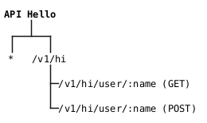

# Programação Web 1
Cosumindo APIs de Terceiros

---

# Objetivo de Aprendizagem
- Aplicar APIs de terceiros em projetos próprios

---

# Agenda
- Criando requisições com Nodejs
- Consumindo a API Hello
- Consumindo a API getBTC

---
layout: section
---

# Criando requisições com Nodejs

---
layout: quote
---

> Uma API define métodos e formatos para os dados das aplicações que podem ser utilizados e reutilizados para solicitação e recebimento de informações através de requisições do protocolo HTTP.

---
layout: quote
---

> O módulo Express do Nodejs é bastante popular para criação de *endpoints* de APIs para atendimento às requisições dos usuários. Para consumir APIs o Nodejs será para aplicado na criação de requisições.

---

# Como Realizar Requisições HTTP?
Módulos típicos
- `requests` (obsoleto)
- Got
    - [Quick Start Guide](https://github.com/sindresorhus/got/blob/HEAD/documentation/quick-start.md)
- Node Fetch
    - [Common usage](https://www.npmjs.com/package/node-fetch#common-usage)
- SuperAgent
    - [Usage](https://www.npmjs.com/package/superagent#usage)
- Axios (mais popular)
    - [Example](https://www.npmjs.com/package/axios#example)

---

# Axios
- Realiza requisições HTTP a partir do Nodejs
- Suporta `Promises`
- Transformações de dados JSON automáticas

---
layout: quote
---

# Promise

> Objeto retonado pela chamada de métodos assíncronos e permite acesso às informações de eventual conclusão ou falha de uma operação assíncrona.

---

# Promise
Possíveis estados

- *pending*: estado inicial
- *fulfilled*: operação concluída e com sucesso
- *rejected*: operação falhou

---

# Usando Axios
Instalação

- `npm install axios`

```js
const axios = require('axios');
```

---

# Axios
GET usando Promise

```js
// Make a request for a user with a given ID
axios.get('/user?ID=12345')
  .then(function (response) {
    // handle success
    console.log(response);
  })
  .catch(function (error) {
    // handle error
    console.log(error);
  })
  .finally(function () {
    // always executed
  });
```

---

# Axios 
GET com Promise e `params`

```js
// Optionally the request above could also be done as
axios.get('/user', {
    params: {
      ID: 12345
    }
  })
  .then(function (response) {
    console.log(response);
  })
  .catch(function (error) {
    console.log(error);
  })
  .finally(function () {
    // always executed
  });
```

---

# Axios
GET com `async/await`

```js
// Want to use async/await? Add the `async` keyword to your outer function/method.
async function getUser() {
  try {
    const response = await axios.get('/user?ID=12345');
    console.log(response);
  } catch (error) {
    console.error(error);
  }
}
```

---

# Axios
Exemplo de POST

```js
axios.post('/user', {
    firstName: 'Fred',
    lastName: 'Flintstone'
  })
  .then(function (response) {
    console.log(response);
  })
  .catch(function (error) {
    console.log(error);
  });
```

---

# Axios
`axios(config)`

```js
// Send a POST request
axios({
  method: 'post',
  url: '/user/12345',
  data: {
    firstName: 'Fred',
    lastName: 'Flintstone'
  }
});
```

---
layout: section
---

# Consumindo a API Hello

---
layout: statement
---

# A ideia é criar a aplicação `HelloApp` que utiliza, aplica (consome) os recursos da `API Hello` criada na aula anterior.

---

# HelloApp

1. Criar a rota `/` com um *form* de um único campo (Nome do usuário)
2. O *form* envia (via POST) para a rota `/who`
3. Em `/who` o Nome é passado pela API Hello que faz seu trabalho e retorna para Hello App
4. Ainda em `/who` a informação é mostrada ao usuário

---

# API Hello (Aula anterior)
*Endpoints*



[<logos-git-icon /> API Hello](https://github.com/pw1-repo/apihello.git)

---

# HelloApp
Iniciando o projeto

1. Criar o diretório `helloapp` (ou outro nome de sua preferência)
2. `npm init -y`
3. `npm install express axios ejs`
4. Criar o arquivo `app.js`

---

# HelloApp
`app.js`

```js
const express = require('express')
const app = express()
const axios = require('axios')
app.set('view engine', 'ejs');
const PORT = 3000
app.listen(PORT, () => {
  console.log(`Server running on http://localhost:${PORT}`)
})
app.use(express.urlencoded({ extended: true }))
// URL da API
const API_URL = '' 
```

**Sugestão**: Usar a API Hello através do GitHub Codespaces.

---

# HelloApp
Adicionando as rotas `/` e `/who` ao `app.js`

```js
app.get('/', async (req, res) => {
    res.render('index');
})

app.post('/who', async (req, res) => {
  const username = req.body.username
  console.log(`Variável username recebida do form: ${username}`)
  res.render('greeting', { msg: username })
})
```

---

# HelloApp
Adicionando os *templates* em `/views`

5. Criar o diretório `views` e dentro dele o diretório `partials`
6. Em `views` adicionar os arquivos `index.ejs` e `greeting.ejs`
7. Em `partials` adicionar os arquivos `header.ejs` e `footer.ejs`

---

# HelloApp
`header.ejs` e `footer.ejs`

```html
<!doctype html>
<html lang="en">
  <head>
    <meta charset="utf-8">
    <meta name="viewport" content="width=device-width, initial-scale=1">
    <title>HelloApp</title>
    <link href="https://cdn.jsdelivr.net/npm/bootstrap@5.2.3/dist/css/bootstrap.min.css" rel="stylesheet" integrity="sha384-rbsA2VBKQhggwzxH7pPCaAqO46MgnOM80zW1RWuH61DGLwZJEdK2Kadq2F9CUG65" crossorigin="anonymous">
  </head>
  <body>
```
<br><br>
```html
    <script src="https://cdn.jsdelivr.net/npm/bootstrap@5.2.3/dist/js/bootstrap.bundle.min.js" integrity="sha384-kenU1KFdBIe4zVF0s0G1M5b4hcpxyD9F7jL+jjXkk+Q2h455rYXK/7HAuoJl+0I4" crossorigin="anonymous"></script>
  </body>
</html>
```

---

# HelloApp
`index.ejs`

```js
<%- include('./partials/header'); %>
<div class="container d-flex vh-100">
    <div class="row justify-content-center align-self-center w-100">
        <div class="col-md-6">
          <div class="card shadow">
            <div class="card-body">
              <h4 class="card-title mb-4">Quem é você?</h4>
              <form method="POST" action="/who">
                <div class="mb-3">
                  <input type="text" class="form-control" name="username" placeholder="Digite seu nome" required />
                </div>
                <button type="submit" class="btn btn-primary w-100">Enviar</button>
              </form>
            </div>
          </div>
        </div>
    </div>
</div>
<%- include('./partials/footer'); %>
```
---

# HelloApp
`greeting.ejs`

```js
<%- include('./partials/header'); %>
<div class="container d-flex vh-100">
        <div class="row justify-content-center align-self-center w-100">
          <div class="col-md-6">
            <div class="card shadow">
              <div class="card-body">
                <h4 class="card-title mb-3">Resposta da API</h4>
                <p class="card-text mb-4"><strong><%= msg %></strong><br></p>
                <form method="GET" action="/">
                  <button type="submit" class="btn btn-secondary w-100">Executar novamente</button>
                </form>
              </div>
            </div>
        </div>
    </div>
</div>
<%- include('./partials/footer'); %>
```

---
layout: image-right
image: ./img/HelloAppForm.png
backgroundSize: contain
---

# HelloApp
Teste parcial

8. Rode aplicação `node app` e veja a tela inicial
9. Pare a aplicação

---

# HelloApp
`/who`

```js
app.post('/who', async (req, res) => {
  const username = req.body.username
  console.log(`Variável username recebida do form: ${username}`)

  try {
    const response = await axios.get(`${API_URL}/v1/hi/`)
    //console.log(response)
    res.render('message', { msg: response.data.msg });
  } catch (err) {
    res.send('Erro ao acessar API.')
  }
})
```

---
layout: quote
---

> **E se...** a API utilizada aceitar requisições apenas a partir de um método específico? POST, por exemplo.

---

# HelloApp
`/whobypost`

```js
app.post('/whobypost', (req, res) => {
    const username = req.body.username
    const url_ = `${API_URL}/v1/hi`
    console.log(`Variável username recebida do form: ${username}`)
    axios({
        method: 'post',
        url: url_,
        headers: {
            'Content-Type': 'application/x-www-form-urlencoded'
        },
        data: {
            name: `${username}`
        }
    })
    .then(response => {
        //console.log(response)
        res.render('message', {msg: response.data.msg});
    })
    .catch(err => {
        console.error(err.message)
        res.send('Erro ao acessar API.')
    })
})
```

---

# APIs Públicas

- Existem diversos repositórios de APIs públicas que podem ser utilizadas em projetos
- Existem também APIs pagas
- Seguem alguns exemplos de respositórios de APIs públicas:
  - [A directory of free and public apis](https://publicapis.io/)
  - [Public REST APIs](https://www.postman.com/cs-demo/public-rest-apis/overview)

---
layout: fact
---

# Exercícios

---

# 1

Criar uma aplicação Mensagem do Dia que consome a API [Ron Swanson Quotes](https://www.postman.com/cs-demo/public-rest-apis/request/uc3wcpm/ron-swanson-quotes). Utilize Express, Bootstrap e EJS. Ferramentas alternativas podem ser aplicadas.

---

# Referências

- [API Hello](https://github.com/pw1-repo/apihello.git)
- [mdn web docs Promises](https://developer.mozilla.org/en-US/docs/Web/JavaScript/Reference/Global_Objects/Promise)

---
layout: end
---

# Prof. José Roberto Bezerra
jbroberto@ifce.edu.br
<br><br>
<PoweredBySlidev />
