```mermaid
architecture-beta
    group api

    service db(database)[Database] in api
    service server(server)[Web Server] in api
    service cloud(cloud)

    service WebApp(logos:aws)

    WebApp:L -- R:cloud
    cloud:L -- R:server
    db:R -- L:server
```

# {{ $slidev.configs.title }}
Programação Web 1

---

# Objetivo de Aprendizagem
- Construir uma API com acesso a bancos de dados

---

# Agenda
- CRUD
- CRUD + REST

---
layout: section
---

# CRUD

---
layout: quote
---

> *Create, Read, Update* e *Delete* são as quatro funções elementares que modelos de bancos de dados deve implementar. Paradigma popular no desenvolvimento de *software*, especialmente na *web*.

[What is CRUD?](https://www.codecademy.com/article/what-is-crud-explained)

---

# REST API



---

# REST API

```plantuml
@startuml Serverless API
' from https://github.com/awslabs/aws-icons-for-plantuml/blob/main/examples/Serverless%20API.puml

!define AWSPuml https://raw.githubusercontent.com/awslabs/aws-icons-for-plantuml/v18.0/dist
!include AWSPuml/AWSCommon.puml
!include AWSPuml/AWSExperimental.puml
!include AWSPuml/ApplicationIntegration/APIGateway.puml
!include AWSPuml/Compute/Lambda.puml
!include AWSPuml/Database/DynamoDB.puml
!include AWSPuml/General/Client.puml
!include AWSPuml/Groups/AWSCloud.puml
!include AWSPuml/Storage/SimpleStorageService.puml

' Groups are rectangles with a custom style using stereotype - need to hide
hide stereotype
skinparam linetype ortho
skinparam rectangle {
    BorderColor transparent
}

rectangle "$ClientIMG()\nClient" as client
AWSCloudGroup(cloud){
  rectangle "$APIGatewayIMG()\nAmazon API\nGateway" as api
  rectangle "$LambdaIMG()\nAWS Lambda\n" as lambda
  rectangle "$DynamoDBIMG()\nAmazon DynamoDB\n" as dynamodb
  rectangle "$SimpleStorageServiceIMG()\nAmazon S3" as s3
  rectangle "$LambdaIMG()\nAWS Lambda" as trigger

  client -right-> api: <$Callout_1>\n
  api -right-> lambda: <$Callout_2>\n
  lambda -right-> dynamodb: <$Callout_3>\n
  api -[hidden]down-> s3
  client -right-> s3: <$Callout_4>
  s3 -right-> trigger: <$Callout_5>\n
  trigger -[hidden]up-> lambda
  trigger -u-> dynamodb: <$Callout_6>\n
}
@enduml
```

---

# Exemplo
Gerenciamento de bliblioteca

- Espera-se que exista um recurso associado a livros
- A aplicação deve ser capaz de realizar operações CRUD nos recursos

```js{*}{lines: false, class: '!children:text-xl'}
{
  isbn: "9781593277574",
  title: "Understanding ECMAScript 6",
  subtitle: "The Definitive Guide for JavaScript Developers",
  author: "Nicholas C. Zakas",
  published: "2016-09-03T00:00:00.000Z",
  publisher: "No Starch Press",
  pages: 352,
  description: "ECMAScript 6 represents the biggest update to the core of JavaScript in the history of the language. In Understanding ECMAScript 6, expert developer Nicholas C. Zakas provides a complete guide to the object types, syntax, and other exciting changes that ECMAScript 6 brings to JavaScript.",
  website: "https://leanpub.com/understandinges6/read"
}
```

---

# CREATE

- Função que deve ser aplicada para adicionar um novo livro ao catálogo
- Como o ISBN é um campo único, pode ser usado como chave
- Funções do BD
  - <logos-mongodb-icon /> `insertOne()` ou `insertMany()`
  - <logos-sqlite /> `INSERT`

---

# READ

- Função que deve ser aplicada para ler, acessar ou buscar livros no catálogo
- É possível utilizar variações que busquem um livro específico ou grupos de livros de acordo com algum critério
- Apenas leitura sempre
  - <logos-mongodb-icon /> `find()` ou `findOne()`
  - <logos-sqlite /> `SELECT`

---

# UPDATE

- Função que deve ser utilizada para atualizar, alterar informações sobre um livro oou grupo de livros no catálogo
- Um critério de seleção de grupo deve ser passado, caso contrário a alteração será aplicada a todos os ítens
  - Mesmo autor ou mesma data de publicação, etc
  - Título que contém uma palavra chave
- <logos-mongodb-icon /> `updateOne()` ou `updateMany()` ou `replaceOne()`
- <logos-sqlite /> `UPDATE`

---

# DELETE

- Função para remover um único ou múltiplos livros do catálogo de acordo com critérios de seleção similar ao UPDATE
- Deve ser usado com cuidado
- <logos-mongodb-icon /> `deleteOne()` ou `deleteMany()` ou `remove()`
- <logos-sqlite /> `DEL`


---
layout: fact
---

# Exercícios

---

# 1

Criar uma aplicação que utiliza NASA APIs APOD para buscar *links* de imagens que contenham um astro específico passado pelo usuário e que não tenha *copyright*. A aplicação deve exibir as imagens em um carrosel. **Sugestão**: Crie uma chave de API no site para melhor utilização dos recursos.

[Generate API Key](https://api.nasa.gov/#:~:text=Overview-,Generate%20API%20Key,-Authentication)

---

# Referências
- [Final Space API](https://finalspaceapi.com/)
- [NASA Open API](https://api.nasa.gov/)

---
layout: end
---

# Prof. {{ $slidev.configs.author }}
jbroberto@ifce.edu.br
<br><br>
<PoweredBySlidev />