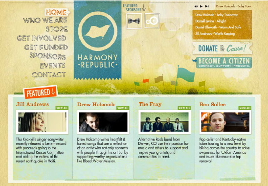
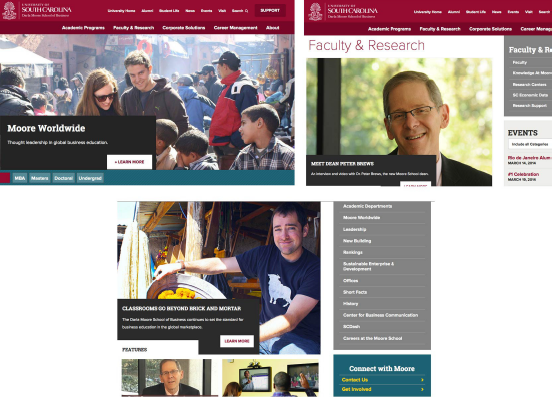
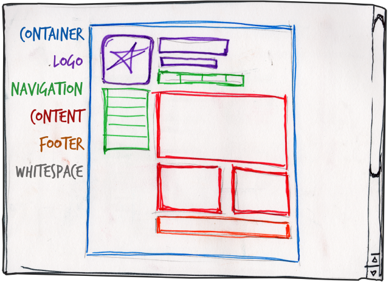
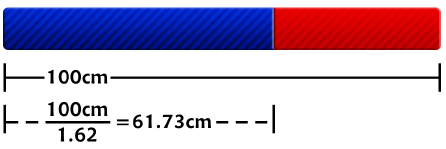
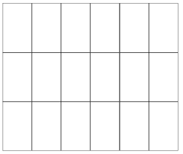
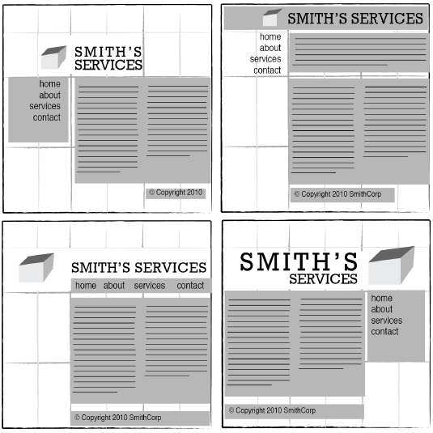
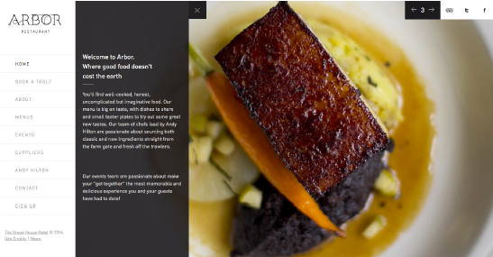
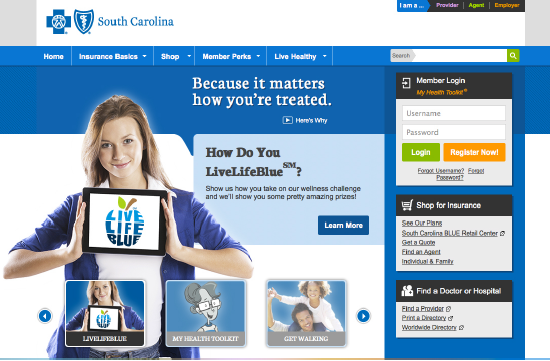
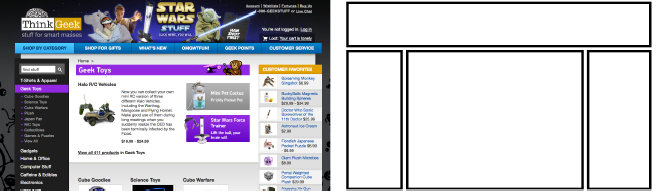

# {{ $slidev.configs.title }}
{{ $slidev.configs.description }}

---

# Objetivos de Aprendizagem
- Conhecer princípios básicos de layout e composição para aplicação no projeto de aplicações web

---

# Agenda
- Planejamento
- O que é um "bom" *design* ?
- *Layouts* típicos
- Exercícios

---
layout: section
---

# Planejamento

---
layout: section
---

> O planejamento visual para a criação de um *site* possui três etapas básicas: Descoberta, Exploração e Implementação.

---

# Descoberta
- Entender o que o cliente faz
- Qual seu público?
- Formal ou informal?
- Meios de acesso ao site? Qual a frequência

---

# Exploração
- Seções que deve possuir
- Cores que pode utilizar
- Esboços de opções de layout
- Funcionalidades que devem existir
- Opções de ferramentas e tecnologias

---

# Implementação
- Implementação de opções de layout para comparação
- Definição de ferramentas e tecnologias

---
layout: section
---

# O que é um "bom" *design*?

---

# Dilemas
- Usabilidade, Funcionalidade e Efetividade
- Beleza, Apelo Visual e Expressão Artística

---

>*The most important point to keep in mind is that design is about communication. If you create a website that works and presents information well, but looks ugly or fails to fit with the client’s brand, no one will want to use it. Similarly, if you make a beautiful website that is hard to use or inaccessible, people will leave.*

---

---

# Menu de navegação
- Fácil visualização
- Auto-descritivo
- Indicação de página atual

---

---

Elementos de *Design*
- *Container*
- Logotipo
- Navegação
- Conteúdo
- Rodapé
- Espaço em branco

---

---

# FIGMA

[Figma para WD](https://classroom.google.com/w/NzIzMzQzNzg3OTI4/t/all)

---

# *Golden Ratio*
- **Proporção divina**
- Pitágoras observou um padrão matemático que ocorre na natureza
- Em *Design* Gráfico as composições são divididas obedecendo a proporção divina tornando-as agradáveis aos olhos

--- 

# Regra dos Terços
- *Rule of thirds*
- Divide-se a composição (site) em 3 partes verticalmente e horizontalmente
- Ajuda a aplicar a proporção divina

---

# Grid
- *Wireframe*
- Essencial para *Design* Gráfico
- Vai além da questão do alinhamento dos elementos
- Relacionado principalmente a proporção

---

---

# 960 Grid System
- *Framework* CSS
- Resoluções típicas de 1024 pixels
- 960 pixels se adequa em 1024 pixels com mais flexibilidade
    - Divisível por 3, 4, 5, 6, 8, 10, 12, 15 e 16
    - Layouts com 12, 16 e 24 colunas
- Base para outros Frameworks
    - Foundation (https://get.foundation/)
    - Bootstrap (https://getbootstrap.com/)
    - Tailwind (https://tailwindcss.com/)

---
layout: section
---

# **Layouts Típicos** 

---

# *Designs* Típicos
- *Left-column navigation*
- *Right-column navigation*
- *Three-column navigation*

---

# *Left-column navigation*
- Caracteriza-se por uma coluna esquerda estreita e direita ampla
- Design bastante utilizado
- Adequado para muitos projetos

---

---

# *Right-column navigation*
- -Destaca o conteúdo
- Desloca elementos secundários (anúncios,navegação, etc) para direita

---

---

# *Three-column navigation*
- Indicado a sites que possuem grande quantidade de elementos
- O uso de espaço em branco é fundamental

---

---

# Referências

- [Figma para WD](https://classroom.google.com/w/NzIzMzQzNzg3OTI4/t/all)
- [Foundation](https://get.foundation/)
- [Bootstrap](https://getbootstrap.com/)
- [Tailwind](https://tailwindcss.com/)

---
src: /snippets/end.md
---