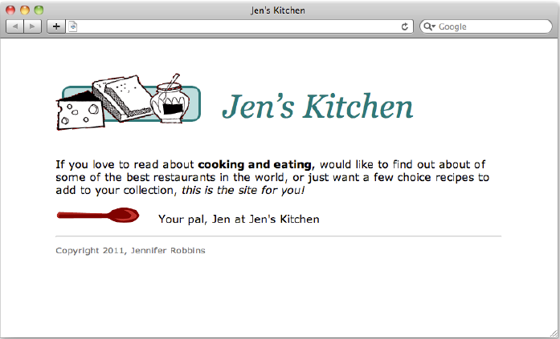
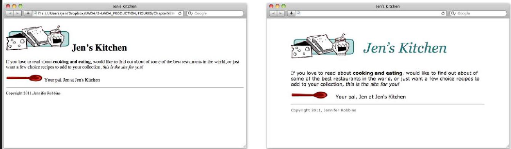
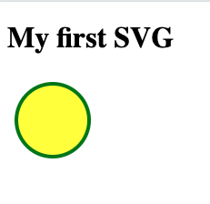

<!-- _class: lead _paginate: false -->
# Programação Web 1
## **HTML5**

---
<!-- class: invert -->
# Objetivos de Aprendizagem
- Conhecer princípios básicos de HTML5

---
# Agenda
- Componentes de um site
- Medição de desempenho
- HTML5
- Exercícios

---
<!-- _class: lead _paginate: false -->
# **Componentes de um site**

---


---
# Componentes
- Página principal (HTML)
- Estilo (CSS)
- Informação visual
- Comportamento

---
# ```index.html```
```html
<!DOCTYPE html>
<html>
<head>
<title>Jen's Kitchen</title>
<link rel="stylesheet" href="kitchen.css" type="text/css" >
</head>
<body>
<h1> Jen&rsquo;s Kitchen</h1>
<p>If you love to read about <strong>cooking and eating</strong>, would like to find 
out about of some of the best restaurants in the world, or just want a few choice 
recipes to add to your collection, <em>this is the site for you!</em></p>
<p> Your pal, Jen at Jen's Kitchen</p>
<hr>
<p><small>Copyright 2011, Jennifer Robbins</small></p>
</body>
</html>
```

---
# ```kitchen.css```

```css
body { 
    font: normal 1em Verdana;
    margin: 1em 10%;
    }
h1 { 
    font: italic 3em Georgia;
    color: rgb(23, 109, 109);
    margin: 1em 0 1em;
    }
img { 
    margin: 0 20px 0 0; 
    }
h1 img { 
    margin-bottom: -20px; 
    }
small {
     color: #666666; 
     }
```
---


---
# Informação visual

- Atenção do usuário
- Apelo visual
- PNG, JPEG, SVG


---
# SVG

```html
<html>
<body>

<h1>My first SVG</h1>

<svg width="100" height="100" xmlns="http://www.w3.org/2000/svg">
  <circle cx="50" cy="50" r="40" stroke="green" stroke-width="4" fill="yellow" />
</svg>

</body>
</html>
```

---
# *Scalable Vector Graphics*
- Gráficos vetoriais para web
- Podem ser animados
- É uma recomendação do W3C
- Integra-se a outros padrões: CSS, JavaScript, etc

---
# Comportamento
- Dinamismo
- Ações personalisadas
- Comportamento segundo condições
- JS, PHP, Python, Ruby, C#, etc

---
<!-- _class: lead _paginate: false -->
# **Medição de Desempenho**

---
# Princípios
- Limitar o tamanho dos arquivos
- Reduzir a quantidade de requisições

---
# Ações Práticas
- Otimizar o tamanho das imagens sem comprometer a qualidade
- Minimizar o tamanho de arquivos HTML e CSS (remover espaços em branco e quebras de linha)
- Manter o mínimo necessário de JS
- Usar apenas o necessário em termos de imagens, scripts ou bibliotecas JS
- Reduzir a quantidade de requisições
- HTTP/2

---
# Como Medir o Desempenho?

- Google Chrome
    - View > Developer > Developer Tools
    - Clique em Network
    - Carregue uma página web
- Firefox
    - Ferramentas > Ferramentas do Navegador > Ferramentas de Desenv Web
    - Clicar em Rede
    - Recarregar a página
- Edge
    - CTRL + SHIFT + I

---
# Exercício
> Usando as ferramentas de medição de desempenho mostradas, carregue uma página com grande quantidade de elementos. Por exemplo, site de notícias, Youtube e similares.
- Quanto tempo levou para carregar a página?
- Quais os elementos que mais demoram a carregar?
- Recarregue a página e observe quanto tempo leva o carregamento

---
<!-- _class: lead _paginate: false -->
# **HTML5**

---
# DOCTYPE
- Declaração inicial de todos os documentos HTML5
- ```<!DOCTYPE html>```
- Validadores HTML5
    - https://validator.w3.org/
    - https://html5.validator.nu/

---
# Exercício
> Use um dos validadores HTML5 para validar um site de sua escolha. Baixe o código fonte da página. Em seguida, faça alterações no código fonte da página para reduzir eventuais erros e tornar o arquivo compatível. Faça prints do relatório do validador antes e depois das alterações. Poste os relatórios na atividade Validação HTML5 no Google Classroom.

---
# HTML mínimo
- O elemento mais importante é o *Document Type Declaration*
(linha 1)
- ```<html>``` é dividido em ```<head>``` e ```<body>```
- ```<head>``` contém informações sobre o documento
- ```<body>``` contém tudo que deve ser visível, renderizado

```html
<!DOCTYPE html>
<html>
    <head>
        <meta charset='utf-8'>
        <title>Title here</title>
    </head>
    <body>
        Page content goes here
    </body>
</html> 
```

---
# *Naked Text*
- Todo o texto de um documento deve estar inserido em um elemento (*container*)
- Texto fora de um elemento é chamado “naked text”
- Naked text torna o documento inválido

---
# ```<p>```
- Elemento mais simples
- Pode conter texto e imagens
- Não pode conter cabeçalhos e listas
- Fechamento opcional no HTML5, obrigatório no XHTML

---
# Cabeçalhos
- *Headings*
- Facilita a busca por informações no documento
- Mais destaque ```<h1>```
- Menos destaque ```<h6>```

---
# *Heading Group*

```html
<hgroup>
    <h1>Creating a Simple Page</h1>
    <h2>(HTML Overview)</h2>
</hgroup>
```

---
# Listas
- Ordenadas
- Não ordenadas
- Listas de descrição

---
# Listas Ordenadas
```html
<ol start="4">
<li>item
<li>new item
</ol>
```
<ol start="4">
<li>item
<li>new item
</ol>

---
# Listas Não Ordenadas
```html
<ul>
<li>item
<li>new item
</ul>
```

<ul>
<li>item
<li>new item
</ul>

---
# Tabelas
- Exibição de dados tabulares
- Organização do documento
- [HTML table basics](https://developer.mozilla.org/pt-BR/docs/Learn/HTML/Tables/Basics)


---
# Imagens
- [Imagens no HTML](https://developer.mozilla.org/pt-BR/docs/Learn/HTML/Multimedia_and_embedding/Images_in_HTML)
- ``````
- ``````
- ``````

---
# Organizando o Conteúdo
- HTML5 oferece novas maneiras de organizar e **identificar** o
conteúdo dos documentos além do elemento ```<div>```
- Documentos longos são organizados em capítulos ou seções, etc
- HTML5 oferece elementos alternativos
- ```Section```, ```article```, ```aside``` e ```nav```
- Elementos úteis em conjunto com CSS

---
# ```<article>``` e ```<section>```
```html
<article>
    <h1>Get to Know Helvetica</h1>
    <section>
        <h2>History of Helvetica</h2>
        <p></p>
    </section>
    <section>
        <h2>History of Helvetica</h2>
        <p></p>
    </section>
</article>
```

---
# ```<aside>``` (Sidebar)
- Identifica conteúdo complementar
```html
<aside>
<h2>Web Font Resources</h2>
    <ul>
        <li>Typekit</li>
        <li>Google Fonts</li>
    </ul>
</aside>
```

---
# ```<nav>```
- Identifica elementos de navegação
- Muito utilizado em dispositivos de leitura
```html
<nav>
    <ul>
        <li>Serif</li>
        <li>Sans-serif</li>
        <li>Script</li>
    </ul>
</nav>
```

---
# ```<header>``` e ```<footer>```

---
> Para identificação e classificação do conteúdo em qualquer elemento HTML5 utiliza-se ```<div>``` e ```<span>```
- Não possuem nenhuma função visual
- São utilizados em conjunto com folhas de estilo para identificação *formatação* de forma precisa

---
> Os elementos ```<div>``` e ```<span>``` são complementados por atributos ```id``` e ```class```

---
# ```<div>```
- 

---
# Referências
- [Tutorial SVG](https://www.w3schools.com/graphics/svg_intro.asp)
- [W3C](https://www.w3.org/)
- 