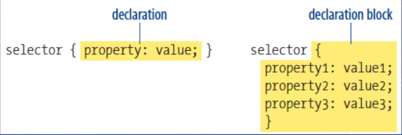

<!-- _class: lead _paginate: false -->
# Programação Web 1
## **CSS**

---
<!-- class: invert -->
# Objetivos de Aprendizagem
- Conhecer princípios básicos de CSS3

---
# Agenda
- Por que CSS?
- Como CSS funciona?
- *Frameworks*

---
<!-- _class: lead _paginate: false -->
# **Por que CSS?**

---
# **Cascading Style Sheets**
- *Layouts* de sites precisos
- Especificação centralizada
- Atualização rápida
- Acessibilidade

---
# Possibilidades do CSS
[CSS Zen Garden](https://www.csszengarden.com/)

---
<!-- _class: lead _paginate: false -->
# **Como CSS funciona?**

---
# Aplicação CSS
- Elementos individuais (inline)
```css
<h1 style="color: red; margin-top: 2em">Introdução</h1>
```
- Embutido no HTML
```html
<head>
    <title>Document Title</title>
    <style>
        /* rules */
    </style>
```

---
# Aplicação CSS
- Arquivo externo (.CSS)
```html
<head>
    <title>Jen's Kitchen</title>
    <link rel="stylesheet" href="kitchen.css" type="text/css">
</head>
```

---
# Estrutura CSS
- Folha de estilo (*sheets*)
    - Conjunto de regras (*rules*)
        - Seletores
        - Declaração (propriedade + valor)



---


---
# Referências