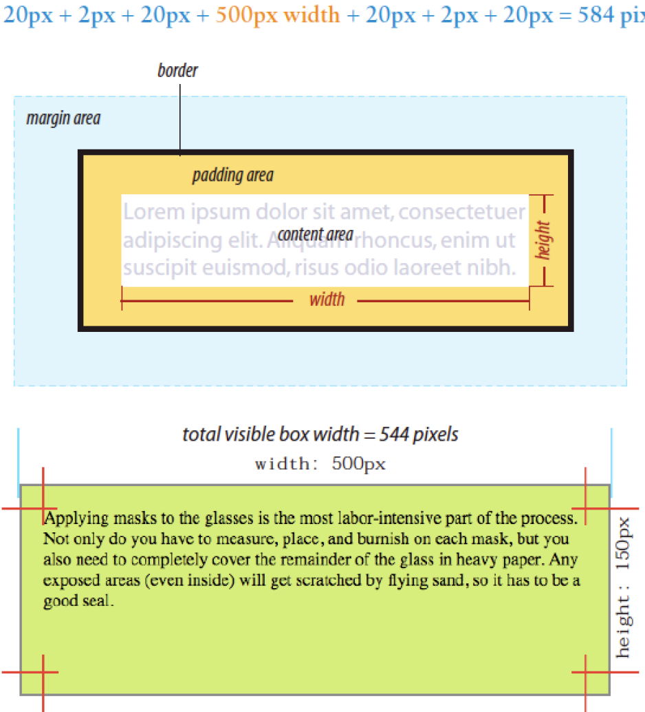
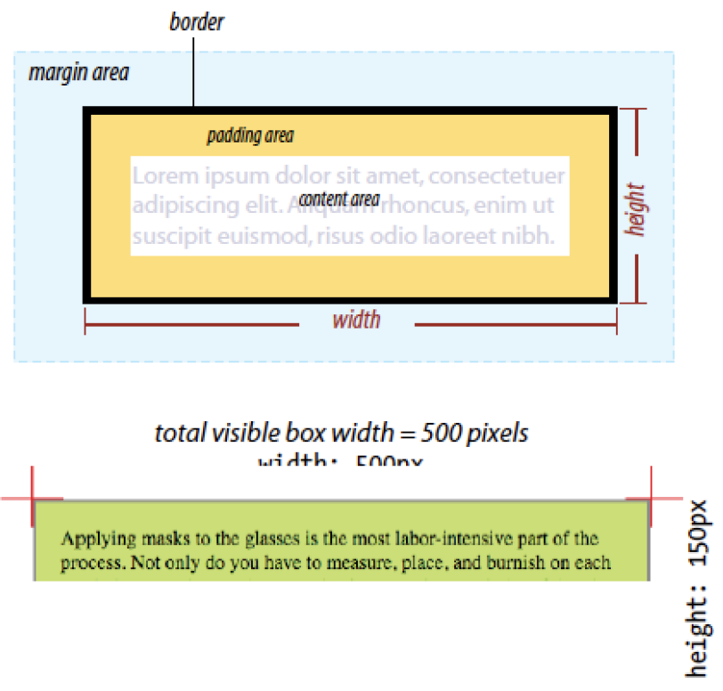
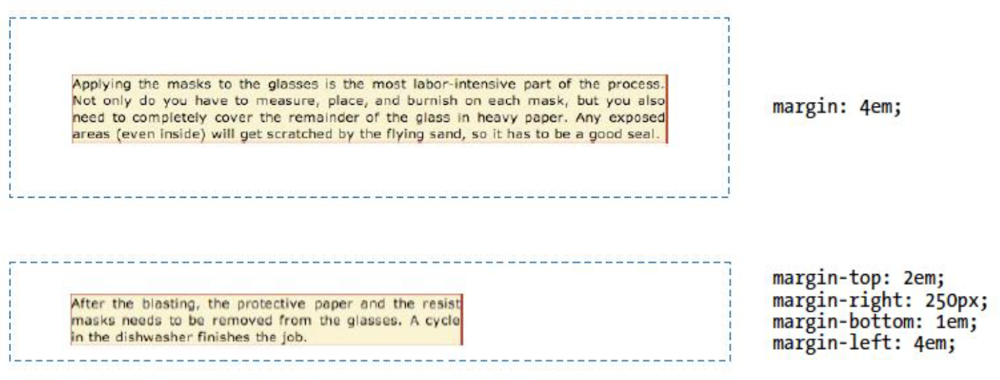

<!-- _class: lead _paginate: false -->
# Programação Web 1
## **CSS**

---
<!-- class: invert -->
# Objetivos de Aprendizagem
- Conhecer princípios básicos de CSS3

---
# Agenda
- Por que CSS?
- Como CSS funciona?
- *Frameworks*

---
<!-- _class: lead _paginate: false -->
# **Por que CSS?**

---
# **Cascading Style Sheets**
- *Layouts* de sites precisos
- Especificação centralizada
- Atualização rápida
- Acessibilidade

---
# Possibilidades do CSS
[CSS Zen Garden](https://www.csszengarden.com/)

---
<!-- _class: lead _paginate: false -->
# **Como CSS funciona?**

---
# Aplicação CSS
- Elementos individuais (inline)
```css
<h1 style=color: red; margin-top: 2em;>Introdução</h1>
```
- Embutido no HTML
```html
<head>
    <title>Document Title</title>
    <style>
        /* rules */
    </style>
```

---
# Aplicação CSS
- Arquivo externo (.CSS)
```html
<head>
    <title>Jen's Kitchen</title>
    <link rel="stylesheet" href="kitchen.css" type="text/css">
</head>
```

---
# Estrutura CSS
- Folha de estilo (*sheets*)
    - Conjunto de regras (*rules*)
        - Seletores
        - Declaração (propriedade + valor)


---
# Conceitos
- Herança
- Conflitos
- *Box model*

---
# Herança


---
# Conflitos
- Podem existir conflitos em definições de estilo
- As folhas de estilo possuem uma hierarquia para resolver tais conflitos:
    1. Definições do navegador
    2. Definições de estilo do usuário (definido no navegador)
    3. Arquivo externo (*link*)
    4. Estilos embutidos (```<style>```)
    5. Estilos *inline*
    6. Regras marcadas com ```!important```

---
# Exemplos
```css
p {color: blue !important;}
```

```html
<style>
    p {color: red;}
    p {color: blue;}
    p {color: green;}
</style>
```
---
# CSS *Box Model*


---
# CSS *Box Model*


---
# ```content-box```

```css
p {
    background: #c2f670;
    width: 500px;
    height: 150px;
    padding: 20px;
    border: 2px solid gray;
    margin: 20px;
}
```

---
# ```border-box```
- Maneira alternativa e mais intuitiva de especificar o tamanho das caixas
- ```box-sizing: border-box```
- Aplica os valores de ```width``` e ```height``` para o box por completo

---
# ```border-box```

```css
p {
    -webkit-box-sizing: border-box;
    -moz-box-sizing: border-box;
    box-sizing: border-box;
    width: 500px;
    height: 150px;
}
```

---
# ```box-sizing```
- Possíveis opções:
    - ```content-box``` (padrão)
    - ```border-box```
    - ```inherit```

---
# ```padding```
```css
    padding: top right bottom left;
```

---
# ```padding```
```css
blockquote: {
    padding: 1em 3em 1em 3em;
    background-color: #D098D4;
}
```

---
# ```border-style```


---
# ```margins```


---
# Propriedades para fontes
```css
/* Set the font size to 12px and the line height to 14px.
   Set the font family to sans-serif */
p {
  font: 12px/14px sans-serif;
}

/* Set the font size to 80% of the parent element
   or default value (if no parent element present).
   Set the font family to sans-serif */
p {
  font: 80% sans-serif;
}

/* Set the font weight to bold,
   the font-style to italic,
   the font size to large,
   and the font family to serif. */
p {
  font: bold italic large serif;
}
```

---
# *Live Sample*

[MDN Web Docs](https://developer.mozilla.org/en-US/docs/Web/CSS/font)

---
# **Quiz CSS**

## Ver Aula 3

---
# Referências
- [CSS Zen Garden](https://csszengarden.com/)
- [Understanding Box Sizing in CSS](https://dev.to/bridget_amana/what-does-box-sizing-border-box-actually-do-3ol5)
- [Design Responsivo](https://developer.mozilla.org/pt-BR/docs/Learn/CSS/CSS_layout/Responsive_Design)