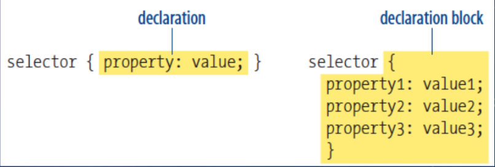

# Programação Web 1
*Cascading Style Sheets*

---

# Objetivo de aprendizagem
Conhecer os princípios básicos do CSS3

---

# Agenda
- Por que CSS?
- Como CSS funciona?
- *Frameworks CSS*

---
layout: section
---

Por que CSS?

---

# **Cascading Style Sheets**
- *Layouts* de sites precisos
- Especificação centralizada
- Atualização rápida
- Acessibilidade

---

# Possibilidades do CSS
[CSS Zen Garden](https://www.csszengarden.com/)

---
layout: section
---

Como CSS Funciona?

---

# Aplicação CSS
- Elementos individuais (*inline*)

```css{*}{class:'!children:text-xl'}
<h1 style="color: red; margin-top: 2em">Introdução</h1>
```

- Embutido no HTML (*embedded*)

```html{3-5}{class:'!children:text-xl'}
<head>
    <title>Document Title</title>
    <style>
        /* rules */
    </style>
```

---

# Aplicação CSS
- Arquivo externo (`.css`)
```html{3}{class:'!children:text-xl'}
<head>
    <title>Jen's Kitchen</title>
    <link rel="stylesheet" href="kitchen.css" type="text/css">
</head>
```

---

# Estrutura CSS
- Folha de estilo (*sheets*)
    - Conjunto de regras (*rules*)
        - Seletores
        - Declaração (propriedade + valor)



---

# Conceitos

- Herança
- Conflitos
- *Box Model*

---

# Herança


---

# Conflitos (Precedência)

- Podem existir conflitos em definições de estilo
- As folhas de estilo possuem uma hierarquia para resolver tais conflitos:
    1. Definições do navegador
    2. Definições de estilo do usuário (definido no navegador)
    3. Arquivo externo (link)
    4. Estilos embutidos (`<style>`)
    5. Estilos *inline*
    6. Regras marcadas com `!important`

---

# Exemplos

```css{*}{class: '!children:text-2xl'}
p {color: blue !important}
```
<br><br>
```html{*}{class: '!children:text-2xl'}
<style>
    p {color: red;}
    p {color: blue;}
    p {color: green;}
</style>
```

---
layout: center
---


---
layout: center
---


---

# Propriedade *Padding*
Exemplo
```css{*}{class: '!children:text-2xl'}
p {
    padding-top: 5px;
    padding-right: 10px;
    padding-bottom: 15px;
    padding-left: 20px;
}
```

---

# `padding` *Shorthands* (4 valores)

```css{*}{class: '!children:text-2xl'}
padding: top right bottom left
```
<br><br>
```css{*}{class: '!children:text-2xl'}
blockquote {
    padding: 1px 3px 1px 3px;
    background-color: #D098D4
}
```

---

# `padding` *Shorthands* (3 valores)

```css{*}{class: '!children:text-2xl'}
padding: top right+left bottom
```
<br><br>

```css{*}{class: '!children:text-2xl'}
blockquote {
    padding: 10px 30px 10px;
}
```

---

# `padding` *Shorthands* (2 valores)

```css{*}{class: '!children:text-2xl'}
padding: top+bottom right+left
```
<br><br>

```css{*}{class: '!children:text-2xl'}
blockquote {
    padding: 10px 30px;
}
```

---

# `padding` *Shorthands* (1 valor)

```css{*}{class: '!children:text-2xl'}
padding: top+bottom+right+left
```
<br><br>

```css{*}{class: '!children:text-2xl'}
blockquote {
    padding: 15px;
}
```

---
layout: center
---

# Estilos de borda


---
layout: two-cols-header
---

# Propriedades *Border*

::left::

- `border-style`
- `border-width`
- `border-color`

::right::

```css{*}{class: '!children:text-2xl'}
p.one {
  border-style: solid;
  border-width: 5px;
  border-color: red;
}
```

---

# *Shorthand* `border`

```css{*}{class: '!children:text-2xl'}
p {
  border: 5px solid red;
}
```

## Especifica `width`, `style` e `color`

---

# Propriedade *Margins*
Exemplo

```css{*}{class: '!children:text-2xl'}
p {
    margin-top: 5px;
    margin-right: 10px;
    margin-bottom: 15px;
    margin-left: 20px;
}
```

<v-click>

## Disponíveis os *shorthands* de 4 valores até 1 valor

</v-click>

---

# Propriedades para Fontes
Exemplos

```css{*}{class: '!children:text-2xl'}
/* set the font size to 12px and line height to 14px and font family to sans-serif */
p {
    font: 12px / 14px sans-serif;
}
/* set the font size to 80% of the parent element or default (if no parent exists).
Set the font family to sans-serif  */
p {
    font: 80% sans-serif;
}
/* set the font weight to bold, 
the font style to italic,
the font size to large
and the font family yo serif
*/
p {
    font: bold italic large serif;
}
```

---

# Propriedades para Fontes
*Live Sample (Shorthand fonts)*


---

# Melhores *Web Safe Fonts*
Fontes que são instaladas em todos os navegadores de todos os dispositivos

- Arial (sans-serif)
- Verdana (sans-serif)
- Tahoma (sans-serif)
- Trebuchet MS (sans-serif)
- Times New Roman (serif)
- Georgia (serif)
- Garamond (serif)
- Courier New (monospace)
- Brush Script MT (cursive)

---

# Como usar *Google Fonts*?
Alternativa às WSF

## HTML

```html{*}{class: '!children: text-2xl'}
<head>
    <link rel="stylesheet" href="https://fonts.googleapis.com/css?family=Sofia">
    <style>
        body {
            font-family: "Sofia", sans-serif;
        }
    </style>
</head>
```

## CSS

```css{*}{class: '!children: text-2xl'}
@import url('https://fonts.googleapis.com/css?family=Muli');
```

---

# Como usar *Google Fonts*?

- [Documentação *Google Fonts*](https://developers.google.com/fonts?hl=pt-br)
- [Fontes disponíveis](https://fonts.google.com/?hl=pt-br)

---
layout: section
---

*Frameworks* CSS

---

# *Frameworks* CSS
Exemplos

1. **[Tailwind CSS](https://tailwindcss.com/)**  
   - Estilo: *Utility-first*  
   - Destaques: Total controle sobre estilos, performance com JIT, muito usado em projetos modernos e customizados

2. **[Bootstrap 5](https://getbootstrap.com/)**  
   - Estilo: Component-based  
   - Destaques: Fácil de usar, ideal para protótipos e painéis administrativos, grande comunidade

---

# *Frameworks* CSS
Exemplos

3. **[Foundation](https://get.foundation/)**  
   - Estilo: Component-based + responsivo  
   - Destaques: Alta acessibilidade, poderoso para projetos grandes, flexível

4. **[Bulma](https://bulma.io/)**  
   - Estilo: CSS puro com classes utilitárias e componentes  
   - Destaques: Sintaxe simples, leve, sem dependência de JavaScript

---

# *Frameworks* CSS
Exemplos

5. **[Materialize](https://materializecss.com/)**  
   - Estilo: Material *Design*  
   - Destaques: Visual moderno baseado no design do Google, fácil integração

6. **[MUI (Material UI)](https://mui.com/)**  
   - Estilo: *Component-based* para React (Material Design)  
   - Destaques: Altamente usado com React, componentes prontos e acessíveis, grande flexibilidade com tema

---

# Tailwind CSS <logos-tailwindcss-icon />
- **Estilo:** *Utility-first* (baseado em classes utilitárias)  
- **Popularidade:** Muito alto  
- **Por que usar:** Permite personalizar rapidamente o *design* sem sair do HTML. Ótimo para projetos modernos e altamente customizados.  
- **Ideal para:** SPAs (*Single Page Applications*), sites modernos com design único.  
- **Pontos fortes:**
  - Total controle sobre o estilo
  - Extensa documentação  

---

# Bootstrap <logos-bootstrap />

- **Estilo:** *Component-based* (classes prontas para UI)  
- **Popularidade:** Ainda é um dos mais usados  
- **Por que usar:** Rápido de implementar, especialmente para *backends* e protótipos.  
- **Ideal para:** *Dashboards*, sites institucionais.  
- **Pontos fortes:**
  - Sistema de grid poderoso
  - Componentes prontos como `navbar`, `cards`, etc  

---
layout: fact
---

# Perguntas

---
layout: fact
---

# Exercício

Ver Quiz CSS na Aula 3. 

---

# Referências

- [CSS Tutorial W3 Schools](https://www.w3schools.com/Css/)
- [CSS Zen Garden](https://csszengarden.com/)
<!-- - [](https://developer.mozilla.org/en-US/docs/Web/CSS/CSS_flexible_box_layout/Basic_concepts_of_flexbox#alignment_justification_and_distribution_of_free_space_between_items) -->
<!-- - [](https://wpengine.com/resources/combine-flexbox-and-css-grids-for-layouts-how-to/) -->

