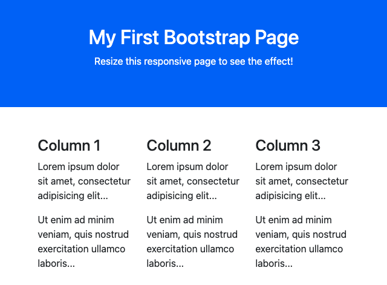

# Programação Web 1
**Bootstrap** <logos-bootstrap />

---

# Objetivo de Aprendizagem
- Trilhar os primeiros passos para utilização do *Framework* CSS Bootstrap

---

# Agenda

- *Quickstart*
- Primeiro *Layout*
- Componentes
- Repositório de exemplos

---
layout: section
---

# **Quickstart**

---

# **HTML Base**
```html{4-5}{class: '!children:text-xl'}
<!DOCTYPE html>
<html lang="en">
<head>
    <meta charset="utf-8">
    <meta name="viewport" content="width=device-width, initial-scale=1">
    <title>Basic HTML File</title>
</head>
<body>
    <h1>Hello, world!</h1>
</body>
</html>
```

[Bootstrap Tutorial](https://www.tutorialrepublic.com/twitter-bootstrap-tutorial/bootstrap-get-started.php)

---

# Primeiros Passos

Adicionar *viewport* (Cabeçalho)
- `<meta name="viewport" content="width=device-width, initial-scale=1">`
<br><br>
Adicionar os arquivos necessários pelo Bootstrap
```html{*}{class: '!children:text-xl'}
<link href="https://cdn.jsdelivr.net/npm/bootstrap@5.0.2/dist/css/bootstrap.min.css" rel="stylesheet" integrity="sha384-EVSTQN3/azprG1Anm3QDgpJLIm9Nao0Yz1ztcQTwFspd3yD65VohhpuuCOmLASjC" crossorigin="anonymous">
```
<br><br>
```html{*}{class: '!children:text-xl'}
<script src="https://cdn.jsdelivr.net/npm/bootstrap@5.0.2/dist/js/bootstrap.bundle.min.js" integrity="sha384-MrcW6ZMFYlzcLA8Nl+NtUVF0sA7MsXsP1UyJoMp4YLEuNSfAP+JcXn/tWtIaxVXM" crossorigin="anonymous"></script>
```

[Bootstrap Tutorial](https://www.tutorialrepublic.com/twitter-bootstrap-tutorial/bootstrap-get-started.php)

---
layout: full
---

```html{7-8,14-15}{class: '!children:text-xl'}
<!DOCTYPE html>
<html lang="en">
<head>
    <meta charset="utf-8">
    <meta name="viewport" content="width=device-width, initial-scale=1">
    <title>Basic Bootstrap Template</title>
    <!-- Bootstrap CSS -->
    <link href="https://cdn.jsdelivr.net/npm/bootstrap@5.0.2/dist/css/bootstrap.min.css" 
    rel="stylesheet" integrity="sha384-EVSTQN3/azprG1Anm3QDgpJLIm9Nao0Yz1ztcQTwFspd3yD65VohhpuuCOmLASjC" 
    crossorigin="anonymous">
</head>
<body>
    <h1>Hello, world!</h1>
    <!-- Bootstrap JS Bundle with Popper -->
    <script src="https://cdn.jsdelivr.net/npm/bootstrap@5.0.2/dist/js/bootstrap.bundle.min.js" integrity="sha384-MrcW6ZMFYlzcLA8Nl+NtUVF0sA7MsXsP1UyJoMp4YLEuNSfAP+JcXn/tWtIaxVXM" crossorigin="anonymous"></script>
</body>
</html>
```

---

# Elementos de Layout
- *Container*
- *Breakpoint*
- Bordas e Fundos
- Margens e `padding`
- *Grids*

---

# *Container*

- Elemento de *design* fundamental
- Uso obrigatório quando um grid é utilizado (quase sempre)
- *Containers* são usadas para:
    - envelopar ou envolver (*wrap*) um determinado conteúdo
    - alinhar conteúdo na página

---

# Tipos de *Container*

- `.container`
- `.container-fluid`
- `.container-{breakpoint}`

---

# `.container`
Cria um container de tamanho fixo em diferentes **breakpoints**
<br><br>
```html{*}{class: '!children:text-2xl'}
<div class="container">
    <h1>This is a heading</h1>
    <p>This is a paragraph of text.</p>
</div>
```

[Boostrap Tutorial](https://www.tutorialrepublic.com/codelab.php?topic=bootstrap&file=responsive-fixed-width-container)

---

# `.container-fluid`
Cria um container de 100% da largura da tela, sempre

```html{*}{class: '!children:text-2xl'}
<div class="container-fluid">
    <h1>This is a heading</h1>
    <p>This is a paragraph of text.</p>
</div>
```

[Bootstrap Tutorial](https://www.tutorialrepublic.com/codelab.php?topic=bootstrap&file=fluid-container)

---

# `.container-{breakpoint}`
Container que ocupa 100% da largura de tela em pontos de quebra (*breakpoints*)

```html{*}{class: '!children:text-2xl'}
<div class="container-sm">100% wide until screen size less than 576px</div>
<div class="container-md">100% wide until screen size less than 768px</div>
<div class="container-lg">100% wide until screen size less than 992px</div>
<div class="container-xl">100% wide until screen size less than 1200px</div>
```

[Bootstrap Tutorial](https://www.tutorialrepublic.com/codelab.php?topic=bootstrap&file=specify-responsive-breakpoints-for-containers)

---

# Adicionando Bordas e Fundos

```html{*}{class: '!children:text-xl'}
<!-- Container with dark background and white text color -->
<div class="container bg-dark text-white">
    <h1>This is a heading</h1>
    <p>This is a paragraph of text.</p>
</div>
<!-- Container with light background -->
<div class="container bg-light">
    <h1>This is a heading</h1>
    <p>This is a paragraph of text.</p>
</div>
<!-- Container with border -->
<div class="container border">
    <h1>This is a heading</h1>
    <p>This is a paragraph of text.</p>
</div>
```

[Bootstrap Tutorial](https://www.tutorialrepublic.com/codelab.php?topic=bootstrap&file=set-background-and-borders-for-containers)

---

# Ajustando `padding` e `margin`

```html{*}{class: '!children:text-2xl'}
<!-- Container with border, extra paddings and margins -->
<div class="container border py-3 my-3">
    <h1>This is a heading</h1>
    <p>This is a paragraph of text.</p>
</div>
```

[Bootstrap Tutorial](https://www.tutorialrepublic.com/codelab.php?topic=bootstrap&file=set-paddings-and-margins-for-containers)

---

# Grid System
- Facilita a criação de *layouts* responsivos de qualquer formato e tamanho
- Utiliza **12** colunas **SEMPRE**
- Tamanhos
    - X-Small, xs (<576px)
    - Small, sm (>=576px)
    - Medium, md (>=768px)
    - Large, lg (>=992px)
    - X-Large, xl (>=1200px)
    - XX-Large, xxl (>=1400px)

---

# Criando um layout de Duas Colunas
```html{*}{class: '!children:text-2xl'}
<div class="container">
    <!--Row with two equal columns-->
    <div class="row">
        <div class="col-md-6">Column left</div>
        <div class="col-md-6">Column right</div>
    </div>
</div>
```

[Bootstrap Tutorial](https://www.tutorialrepublic.com/codelab.php?topic=bootstrap&file=two-column-grid-layouts-for-tablets-and-desktops)

---

# Layout de Duas Colunas iguais
```html{*}{class: '!children:text-2xl'}
<div class="container">
    <!--Row with two equal columns-->
    <div class="row">
        <div class="col">Column one</div>
        <div class="col">Column two</div>
    </div>
</div>
```

---

# Outros Layouts
- [Multicolunas](https://www.tutorialrepublic.com/lib/images/grid-system-illustration.jpg)
- [Aninhados](https://www.tutorialrepublic.com/codelab.php?topic=bootstrap&file=nested-columns)
- [Colunas de tamanho automático](https://www.tutorialrepublic.com/codelab.php?topic=bootstrap&file=size-columns-based-on-the-width-of-their-content)

---
layout: center
---

# Exemplo Layout Fixo

[Exemplo 1](https://www.tutorialrepublic.com/codelab.php?topic=bootstrap&file=fixed-layout)

---
layout: center
---

# Exemplo Layout Fluído

[Exemplo 2](https://www.tutorialrepublic.com/codelab.php?topic=bootstrap&file=fluid-layout)

---
layout: center
---

# Exemplo Layout Responsivo
[Exemplo 3](https://www.tutorialrepublic.com/codelab.php?topic=bootstrap&file=responsive-layout)

---

# Outros Elementos de Layout
Tipografia
- Cabeçalhos (`<h1>` a `<h6>`)
- Parágrafos (`<p>`)
- Citações (`<blockquote>`)

[Exemplos](https://www.tutorialrepublic.com/twitter-bootstrap-tutorial/bootstrap-typography.php)

---
layout: section
---

# Componentes

---

# Botões
[Bootstrap Tutorial](https://www.tutorialrepublic.com/lib/images/bootstrap-5/bootstrap-buttons.png)

```html{*}{class: '!children:text-xl'}
<button type="button" class="btn btn-primary">Primary</button>
<button type="button" class="btn btn-secondary">Secondary</button>
<button type="button" class="btn btn-success">Success</button>
<button type="button" class="btn btn-danger">Danger</button>
<button type="button" class="btn btn-warning">Warning</button>
<button type="button" class="btn btn-info">Info</button>    
<button type="button" class="btn btn-dark">Dark</button>
<button type="button" class="btn btn-light">Light</button>
<button type="button" class="btn btn-link">Link</button>
```

---

# Botões

[Exemplos de botões](https://www.tutorialrepublic.com/twitter-bootstrap-tutorial/bootstrap-buttons.php)

---
layout: center
---

# Cards

---


---


---


[Exemplos de *Cards*](https://www.tutorialrepublic.com/twitter-bootstrap-tutorial/bootstrap-cards.php)

---
layout: center
---

# Navbar

---


---

[Exemplos de Navbar](https://www.tutorialrepublic.com/twitter-bootstrap-tutorial/bootstrap-navbar.php)

---
layout: center
---

# Tabelas

---


---

[Exemplos de Tabela](https://www.tutorialrepublic.com/twitter-bootstrap-tutorial/bootstrap-tables.php)

---
layout: center
---

# Formulários

---


[Exemplos de Forms](https://www.tutorialrepublic.com/twitter-bootstrap-tutorial/bootstrap-forms.php)

---

# Outras fontes de consulta
- [Tutorial Bootstrap 5.3](https://getbootstrap.com/docs/5.3/getting-started/introduction/)
- [Repositório de Temas](https://startbootstrap.com/)
- [Tutorial W3Schools](https://www.w3schools.com/bootstrap5/)

---
layout: fact
---

# Perguntas

---
layout: fact
---

# Exercícios

---
layout: image-right
# the image source
image: /img/exerc_bootstrap.png
# a custom class name to the content
#class: my-cool-content-on-the-left
---

# Exercício 1 (Não é necessário enviar)

Utilizando o Bootstrap, criar um *layout* similar ao mostrado na figura contendo os elementos:
- Cabeçalho com título
- Corpo com 3 colunas



---

#  Exercício 1 (Não é necessário enviar)

**Dicas**
- Utilize o arquivo HTML base para iniciar
- Crie uma `<div>` para cada elemento acima
- Defina o tipo de *container* para cada uma delas
- Defina a largura das colunas
- Adicione cores, cabeçalhos e *breakpoints*
- Use o tutorial abaixo para lhe auxiliar

[Bootstrap Tutorial W3 Schools](https://www.w3schools.com/bootstrap5/tryit.asp?filename=trybs_default&stacked=h)

---

# Exercício 2 (Atividade Bootstrap)

Modifique o *design* do exercício anterior adicionando os seguintes elementos:
- No *header* acrescente *links* (home, news, contact) usando o componente Navs ou Navbar
- Em cada coluna, acrescente um Card contendo uma imagem, um título, conteúdo e um botão.
- Abaixo das colunas adicione o componente **Jumbotron** com uma informação de destaque
- Adicione um rodapé com fundo cinza o logotipo do Bootstrap e a mensagem "Feito com Bootstrap"

---

# Referências
- https://www.tutorialrepublic.com/twitter-bootstrap-tutorial/

---
layout: center
---

FIM

<PoweredBySlidev />


