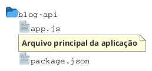

# {{ $slidev.configs.title }}
{{ $slidev.configs.description }}

---


---


# Exercício Avançado
Blog Pessoal com Express

> Aplicação prática para consolidar os conceitos de rotas, *middlewares* e tratamento de requisições com Express

---

# Contexto

Criar uma **API simples para um blog pessoal**. O foco é praticar:

- Rotas com diferentes métodos HTTP
- Route params (`req.params`)
- Middlewares básicos (application level)
- Manipulação de requisições e respostas
- `res.redirect()` e `res.status()`

---

# Estrutura do Projeto


---

# Dados em Memória
No início do `app.js`, criar um *array* de posts

```javascript
const posts = [
  { id: 1, titulo: "Meu primeiro post", conteudo: "Olá mundo!", autor: "João" },
  { id: 2, titulo: "Aprendendo Express", conteudo: "Estou gostando muito!", autor: "Maria" }
];
let proximoId = 3;
```

---

# Rotas a Implementar

Método	Rota	Descrição

GET	/	Página inicial com mensagem de boas-vindas
GET	/posts	Listar todos os posts (JSON)
GET	/posts/:id	Exibir um post específico
POST	/posts	Criar um novo post
PUT	/posts/:id	Atualizar um post existente
DELETE	/posts/:id	Remover um post
GET	/sobre	Página sobre o blog
GET	/autores/:nome	Listar posts de um autor
Middlewares

---

# Middlewares
1. Logger Simples (Application Level)

Crie um middleware que registra cada acesso no console no formato abaixo: 

- método HTTP
- URL acessada
- Horário da requisição

Exemplo de formato: 

`[GET] /posts - 10:30:45`

```js
app.use((req, res, next) => {
  // Implemente o logger aqui
  next();
});
```

---

# Middlewares
2. Validador de ID (Router Level)

> Crie um *middleware* que verifica se o `:id` passado é um número válido. Se não for, retorna `status 400: { error: "ID inválido" }`. Aplique nas rotas que usam `:id`

```js
const validaId = (req, res, next) => {
  // Implemente a validação aqui
};
```

---
layout: section
---

# Detalhamento das Rotas

---

# `GET /posts`

- Retorna a lista completa de posts em JSON
- Se não houver posts, retorna array vazio `[]`

```js
app.get('/posts', (req, res) => {
  // Implemente
});
```

---

# `GET /posts/:id`

- Retorna o post correspondente ao ID
- Se não encontrar, retorna `status 404: { error: "Post não encontrado" }`

```js
app.get('/posts/:id', validaId, (req, res) => {
  // Implemente
});
```

---

# `POST /posts`

- Recebe JSON no `body: { titulo, conteudo, autor }`
- Todos os campos são obrigatórios
- Se faltar algum, retorna `status 400: { error: "Todos os campos são obrigatórios" }`
- Adiciona novo post com ID automático
- Retorna o post criado com status 201

```js
app.post('/posts', (req, res) => {
  // Implemente
});
```

---

# `PUT /posts/:id`

- Recebe JSON no `body: { titulo, conteudo, autor } (todos opcionais)`
- Atualiza apenas os campos enviados
- Se o post não existir, retorna 404
- Retorna o post atualizado

```js
app.put('/posts/:id', validaId, (req, res) => {
  // Implemente
});
```

---

# `DELETE /posts/:id`

- Remove o post do array
- Se o post não existir, retorna 404
- Retorna mensagem de sucesso: `{ message: "Post removido com sucesso" }`

```js
app.delete('/posts/:id', validaId, (req, res) => {
  // Implemente
});
```

---

# `GET /autores/:nome`

- Lista todos os posts de um autor específico
- Busca case-sensitive
- Retorna um array (pode ser vazio)

```js
app.get('/autores/:nome', (req, res) => {
  // Implemente
  // Dica: posts.filter(post => post.autor === req.params.nome)
});
```

---

# `GET /`

- Retorna uma página HTML simples. Conteúdo:
    - Título "Meu Blog"
    - Mensagem de boas-vindas
    - Link para `/posts`
    - Link para `/sobre`

```js
app.get('/', (req, res) => {
  // Implemente
});
```

---

# `GET /sobre`

- Retorna uma página HTML com informações sobre o blog

```js
app.get('/sobre', (req, res) => {
  // Implemente
});
```

---
layout: section
---

# Tratamento de Erros e Redirecionamento

---

# 404
Página não encontrada

- Se o usuário acessar uma rota que não existe, retorne uma página HTML com:
    - Mensagem "Erro 404 - Página não encontrada"
    - Link para voltar para a página inicial (`/`)

```js
app.use((req, res) => {
  res.status(404).send(`
    // Implemente a página de erro
  `);
});
```

---

# Redirecionamento

- Se o usuário acessar uma rota inexistente, redirecione para `/`

```js
app.get('/*splat', (req, res) => {
  res.redirect('/');
});
```

---

<!-- 
```js
// const express = require('express');
// const app = express();
// const port = 3000;

// // Middleware para parsing de JSON
// app.use(express.json());

// // Dados em memória
// const posts = [
//   { id: 1, titulo: "Meu primeiro post", conteudo: "Olá mundo!", autor: "João" },
//   { id: 2, titulo: "Aprendendo Express", conteudo: "Estou gostando muito!", autor: "Maria" }
// ];
// let proximoId = 3;

// // Implemente os middlewares e rotas aqui...

// app.listen(port, () => {
//   console.log(`Blog API rodando em http://localhost:${port}`);
// });
```
-->

---

# Referências
- [Express](https://expressjs.com/)
- [Express JS Tutorial](https://www.tutorialspoint.com/expressjs/index.htm)

---
src: /snippets/end.md
---
