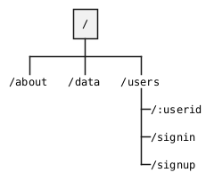

# Programação Web 1
**Express**

---

# Objetivo de Aprendizagem
- Aplicar os conceitos fundamentais do *framework* Express

---

# Agenda

- Funcionamento básico
- *Middlewares*
- Rotas

---
layout: section
---

# Funcionamento Básico

---

# `app.js`

```js {*}{class: '!children:text-xl'}
const express = require('express')
const app = express()
const port = 3000

app.get('/', (req, res) => {
  res.send('Hello World!')
})

app.listen(port, () => {
  console.log(`Example app listening on port ${port}`)
})
```

---

# Tratamento de Requisições
Caso o servidor receba (`req`) uma requisição GET em `/` a função de *callback* será retornada

```js {5-7}{class: '!children:text-xl'}
const express = require('express')
const app = express()
const port = 3000

app.get('/', (req, res) => {
  res.send('Hello World!')
})

app.listen(port, () => {
  console.log(`Example app listening on port ${port}`)
})
```

---

# Roteamento Básico

> *Routing refers to determining how an application responds to a client request to a particular endpoint, which is a URI (or path) and a specific HTTP request method (`GET`, `POST`, and so on)*.

---

# Roteamento Básico
`app.METHOD(PATH, HANDLER)`

- *Routing*
- `app` = instância do `express`
- **METHOD** = método HTTP a ser tratado
- **PATH** = caminho no servidor
- **HANDLER** =  função que será executada quando a rota for recebida

---

# Exemplos

```js {1-3|4-6}{class: '!children:text-xl'}
app.put('/', (req, res) => {
    res.send('Got a PUT request’)
})
app.post('/', (req, res) => {
    res.send('Got a POST request’)
})
```

---
layout: fact
---

# Como realizar testes com diferentes métodos?

---
layout: quote
---

> [Postman](https://www.postman.com/) *is an API platform for building and using APIs. It simplifies each step of the API lifecycle and streamlines collaboration so you can create better APIs—faster*.

---

# `app.all`
Método de roteamento especial utilizado para todos os métodos HTTP (GET, POST, PUT, DELETE, etc)

```js {*}{class: '!children:text-xl'}
app.all('/secret', (req, res, next) => {
  console.log('Accessing the secret section ...')
  next() // pass control to the next handler
})
app.get('/secret', (req, res) => {
  res.send("Secret method acessed")
})
```

---

# Parâmetros de Rotas
São utilizados para passar parâmetros pelas URLs via `req.params`

```js {*}{class: '!children:text-xl'}
app.get('/user/:id', (req, res) => {
  res.send(`user ${req.params.id}`)
})
```

---

# Exemplos


<v-click hide>

Route path: `/flights/:from-:to`<br>
Request URL: `http://localhost:3000/flights/LAX-SFO`<br>
`req.params: { "from": "LAX", "to": "SFO" }`

</v-click>


<v-click>

Route path: `/plantae/:genus.:species`<br>
Request URL: `http://localhost:3000/plantae/Prunus.persica`<br>
`req.params: { "genus": "Prunus", "species": "persica" }`

</v-click>

---
layout: two-cols-header
---

# Propriedades e Métodos Úteis

::left::

## `request`
- `req.url`
- `req.cookies`
- `req.ip`
- `req.params`
- `req.path`

::right::

## `response`
- `res.attachment()`
- `res.cookie()`
- `res.end()`
- `res.status()`
- `res.json()`

---
layout: section
---

# *Middleware*

---
layout: quote
---

> *Middleware functions have access to the request object (`req`), the response object (`res`), and the `next` function in the application’s request-response cycle.*

---

# *Middlewares*
Executam diversas tarefas

- Execução de código
- Modificam os objetos de requisição e/ou resposta
- Finalizam o ciclo de requisição e resposta
- Chamam a próxima função de *middleware* da pilha

---
layout: image-left
image: https://expressjs.com/images/express-mw.png
backgroundSize: contain
---

<br><br>

- Método HTTP
- Caminho (rota)
- Função de MW

<br><br>

- `next` *callback*
- HTTP *response* (para o cliente)
- HTTP *request* (vinda do cliente)

---

# Exemplo

```js {*}{class: '!children:text-xl'}
const express = require('express')
const app = express()

const myLogger = function (req, res, next) {
  console.log('LOGGED')
  next()
}

app.use(myLogger)

app.get('/', (req, res) => {
  res.send('Hello World!')
})

app.listen(3000)
```

---

# Exemplo

```js {*}{class: '!children:text-xl'}
const express = require('express')
const app = express()

const requestTime = function (req, res, next) {
  req.requestTime = Date.now()
  next()
}

app.use(requestTime)

app.get('/', (req, res) => {
  let responseText = 'Hello World!<br>'
  responseText += `<small>Requested at: ${req.requestTime}</small>`
  res.send(responseText)
})

app.listen(3000)
```

---

# Tipos de *Middlewares*

- MW de aplicação (*apllication level*)
- MW de roteamento (*router level*)
- MW de tratamento de erro
- *Embedded*

---

# *Application Level MW*
- Associadas a uma instância de app
    - `app.use()`
    - `app.METHOD()`

# *Router Level MW*
- Funcionamento similar aos MW de aplicação
- Rodam em uma instância `express.router()` ao invés de `express.app()`
- Podem ser usadas através de `router.use()` ou `router.METHOD()``

---

# Exemplo

```js {*}{class: '!children:text-xl'}
const express = require('express')
const app = express()
const router = express.Router()

// simple logger for this router's requests
// all requests to this router will first hit this middleware
router.use((req, res, next) => {
  console.log('%s %s %s', req.method, req.url, req.path)
  next()
})

// this will only be invoked if the path starts with /bar from the mount point
router.use('/bar', (req, res, next) => {
  // ... maybe some additional /bar logging ...
  next()
})

// always invoked
router.use((req, res, next) => {
  res.send('Hello World')
})

app.use('/foo', router)

app.listen(3000)
```

---

# MW de Tratamento de Erros
Similar aos demais, porém com 4 argumentos

```js {*}{class: '!children:text-xl'}
app.use((err, req, res, next) => {
  console.error(err.stack)
  res.status(500).send('Something broke!')
})
```

---

# *Embedded*
*Middlewares* incluídos no Express

- `express.static`
    - Serve arquivos estáticos (imagens, CSS, *scripts*)
- `express.json`
    - Serve arquivos JSON
- `express.urlencoded`
    - Trata requisições com URLs codificadas

---
layout: fact
---

# Perguntas

---
layout: fact
---

# Exercício

---

# Atividade Express

Criar uma aplicação utilizando o *framework* Express que contenha a estrutura mínima mostrada no diagrama abaixo. Cada página atende com requisições GET. A rota `/data` atende com requisição POST.



---

# Atividade Express (Requisitos)

1. Criar uma função de Middleware para cada uma das rotas mostradas exibindo apenas
uma página com nome da rota
2. Criar uma função Middleware de aplicação que realiza o registro no console do acesso a cada página (ver exemplos anteriores nesta aula)
3. Em `signin`, criar uma rota (/users/:userid)
que recebe o `userid` do usuário e exibe na página uma msg de boas vindas usando esse valor
4. Caso o usuário acesse sem `userid` é direcionado a página signup (pesquise como usar `res.redirect()`)

---

# Atividade Express (Requisitos)

5. Qualquer outra página que não tenha a rota indicada é direcionada para página de erro 404 com link para o index (pesquise como usar `res.status()`) 

---

# Referências
- [Express](https://expressjs.com/)
- [Express JS Tutorial](https://www.tutorialspoint.com/expressjs/index.htm)

---
layout: end
---

# Prof. José Roberto Bezerra
jbroberto@ifce.edu.br
