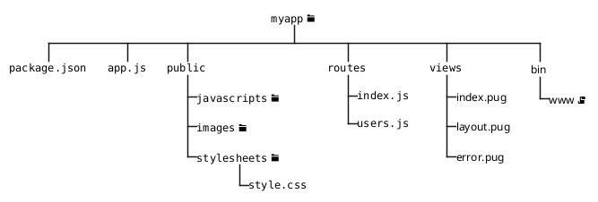
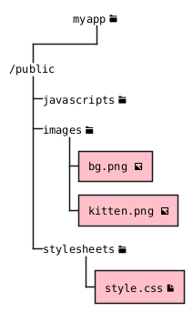

# Programação Web 1
Rotas com Express

---

# Objetivos de Aprendizagem
- Aprimorar o uso de rotas com Nodejs
- Conhecer as funcionalidades da estrutura de diretórios do Express-Generator

---

# Agenda

- Criando um projeto com Express Generator
- Estrutura de diretórios
- Servindo arquivos estáticos
- Rotas
- *Templates*

---
layout: section
---

# Criando um projeto com Express Generator

---

# Express Generator

> Use the application generator tool, `express-generator`, to quickly create an application skeleton.

---

# Instalação
Para instalar o `express-generator` siga os passos abaixo

1. Criar o diretório onde o projeto será criado, por exemplo `path`
2. Dentro do diretório, utilize o console (terminal, linha de comando, Shell, etc) para entrar com os comandos abaixo

```bash {*}{class: '!children:text-xl'}
npm install express express-generator
npx express-generator --view=ejs 
```

3. Caso o nome da aplicação seja passado no comando (por exemplo, `npx express-generator myapp`) um diretório com o nome da aplicação é criado
4. Desta forma uma estrutura padrão (*skeleton*) de aplicação é criada

---
layout: center
---

# Estrutura



---

# Executando a Aplicação Demo
`npm start`

```json {5-6}{class: '!children:text-xl'}
{
  "name": "app1",
  "version": "0.0.0",
  "private": true,
  "scripts": {
    "start": "node ./bin/www"
  },
  "dependencies": {
    "cookie-parser": "~1.4.4",
    "debug": "~2.6.9",
    "ejs": "~2.6.1",
    "express": "~4.16.1",
    "http-errors": "~1.6.3",
    "morgan": "~1.9.1"
  }
}
```

---
layout: image-right
image: ./img/welcome_to_express.png
backgroundSize: contain
---

# Executando a Aplicação Demo
[http://127.0.0.1:3000/](http://127.0.0.1:3000/)

---
layout: section
---

# Estrutura de diretórios

---

# `/bin/www`

- Ponto de entrada da aplicação
- *Script* de inicialização
- Inicializa o servidor *web*
- Ajusta a porta (padrão 3000)
- Carrega o verdadeito ponto de entrada (`app.js`)

---

# `package.json`

- Informações sobre o projeto
    - Dependências
    - Nome, versão, autor, licença
    - *Script* de inicialização

---
layout: two-cols-header
---

# `app.js`

::left::

- Cria um objeto de aplicação do `express` ( linhas 1-2)
- Configura a aplicação e seus *middlewares*
- Exporta a aplicação (linha 6)

::right::

```js {*}{class: '!children:text-xl'}
const express = require('express')
const app = express()
.
.
.
module.exports = app
```

---
layout: section
---

# Servindo arquivos estáticos

---

# `/public`

- O módulo `express.static` serve arquivos estáticos (imagens, CSS, JS, etc)
- Basta utilizar `app.use(express.static('public'))`
- Desta forma, o diretório public é apontado para essa finalidade

---
layout: two-cols-header
---

# `/public`
O nome do diretório não faz parte do caminho para acessar o arquivo

::left::

- `http://localhost:3000/images/bg.png`
- `http://localhost:3000/images/kitten.png`
- `http://localhost:3000/stylesheets/style.css`

::right::



---

# `/public`
Exemplo de HTML

```html {6,8,11}{class: '!children:text-xl'}
<!DOCTYPE html>
<html lang="pt-BR">
<head>
    <meta charset="UTF-8">
    <title>Exemplo de Página</title>
    <link rel="stylesheet" href="sylesheets/style.css">
</head>
<body style="background-image: url('images/bg.png'); background-size: cover;">
    <h1>Bem-vindo ao Exemplo</h1>
    <p>Esta é uma imagem abaixo:</p>
    
</body>
</html>

```

---
layout: section
---

# Rotas

---

# `/routes`
Os arquivos de cada rota são armazenados neste diretório

- A aplicação demo utiliza dois arquivos: `index.js` e `users.js`
- A estrutura é basicamente a mesma
- Os caminhos **sempre** se referem a rota `/`. Por que???

```js {*}{class: '!children:text-xl'}
var express = require('express');
var router = express.Router();

/* GET home page. */
router.get('/', function(req, res, next) {
  res.render('index', { title: 'Express' });
});

module.exports = router;
```

---

# `/routes`
Porque as rotas são especificadas em `app.js`

- Observe as linhas 7 e 22 (`/`)
- Observe as linhas 8 e 23 (`/users`)

```js {*}{class: '!children:text-lg', startLine:7}
var indexRouter = require('./routes/index');
var usersRouter = require('./routes/users');
```

```js {*}{class: '!children:text-lg', startLine:22}
app.use('/', indexRouter);
app.use('/users', usersRouter);
```

---
layout: section
---

# *Templates*

---
layout: two-cols-header
---

# `res.render()`

::left::

- Em `/routes` temos dois arquivos : `index.js` e `users.js`
- Um *router*  é instanciado na linha 2
    - Ao invés de utilizar `app.get`, ou similar, utiliza-se `router.get()`
- A função `res.render()` faz a renderização da página a partir do *template* `index`
- Por fim, na linha 9 o *router* é exportado

::right::

```js {*}{class: '!children:text-xl'}
var express = require('express');
var router = express.Router();

/* GET home page. */
router.get('/', function(req, res, next) {
  res.render('index', { title: 'Express' });
});

module.exports = router;
```

---

# `/views` 

- Armazena os *templates* utilizados na aplicação
- Diversos *Template Engines* podem ser utilizados
    - *Pug* (padrão do Express)
    - *Mustache*
    - *EJS* (sintaxe que mais se assemelha com HTML)
- Apenas dois parâmetros precisam ser configurados
    - Diretório
    - *Template Engine*

---

# `/views`
Configuração

- Ver linhas 13 e 14 do `app.js`
    - Linha 13 configura o diretório de nome *'views'* para armzenar os *templates* (padrão)
    - Linha 14 configura o EJS como *template engine*

```js {*}{class: '!children:text-lg', startLine:12}
// view engine setup
app.set('views', path.join(__dirname, 'views'));
app.set('view engine', 'ejs');
```

---

# `/views/index.ejs`

- Um *template* EJS é bastante similar ao HTML, exceto por *tags* especiais do próprio EJS
    - A tag `<%= %>` faz com que a variável seja exposta no HTML
    - Nas linhas 3, 6 e 7 o valor de `title` é exibido no HTML renderizado que é exibido ao usuário

```html {*}{class: '!children:text-lg'}
<html>
  <head>
    <title><%= title %></title>
    <link rel='stylesheet' href='/stylesheets/style.css' />
  </head>
  <body>
    <h1><%= title %></h1>
    <p>Welcome to <%= title %></p>
  </body>
</html>
```

---
layout: fact
---

# Perguntas

---
layout: fact
---

# Exercícios

---

# 1
Utilizando o express em conjunto com `express-generator`, explore as possibilidades da utilização de um *router*.

1. Crie o diretório e inicie uma nova aplicação (`npm init`) 
2. Instale os módulos `express` e `express-generator` (`npm install express express-generator`)
3. Use o express-generator para criar a estrutura no diretório criado em **1.** (`npx express-generator --view=ejs [DIRETORIO_CRIADO]`)
4. Observe que já existem duas rotas: `/` e `/users`
5. Acrescentar as rotas `/news` e `/about` fazendo os ajustes necessários em `app.js`
6. Criar os respectivos arquivos de rotas em `/routes` (`news.js` e `about.js`)
    1. Siga o mesmo padrão do arquivo `users.js`
7. Modificar a mensagem *'respond with a resource'*  para uma mensagem de texto apenas informando o nome da página que está sendo acessada (*users, news ou about*)
8. Modifique o valor da variável `title` em `/route/index.js`. O que acontece?
9. Teste todas as rotas

---

# 2
Utilizando o `express` e o `express-generator`, crie um mini site estático.

1. Utilize os arquivos disponibilizados na Aula 7
    - `index.html`, `style.css` e `lapto-from-above.jpg`
2. Rodar aplicação (`npm start`)
    - A figura foi carregada? E a folha de estilos?
    - Faça os ajustes em `index.html`
3. Adicione uma segunda página (`mybedroom.html`)
    - Crie o arquivo HTML com algum conteúdo
    - Modifique `index.html` acrescentando um *link* para `mybedroom.html`

---

# 3 (Atividade Router)
Refazer o exercício da Aula 6 (Express) utilizando agora um `router`. Opcionalmente utilizar o `express-generator` para criar a estrutura básica.

---

# Referências
- [Express Routing](https://expressjs.com/en/guide/routing.html)
- [Express Static Files](https://expressjs.com/en/starter/static-files.html)

---
layout: end
---

# Prof. José Roberto Bezerra
jbroberto@ifce.edu.br
