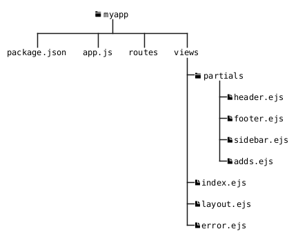
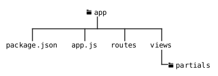
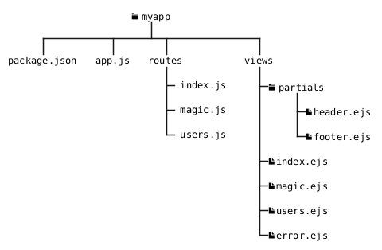

# {{ $slidev.configs.title }}
{{ $slidev.configs.description }}

---

# Objetivos de Aprendizagem
- O que são *Template Engines*?
- Instalar o *Template Engine* EJS
- Utilizar funções básicas de *templates* em geral

---

# Agenda

- *Template engines*
- Instalação
- Exemplo de aplicação com EJS

---
layout: section
---

# *Template Engines*

---
layout: quote
---

# O que são *Template Engines*?

> *Template engines* são especialmente úteis em projetos que requerem a geração de HTML **dinamicamente**. Permitem que os desenvolvedores insiram dados em *templates* (modelos) pré-definidos, resultando em páginas *web* personalizadas e desenvolvidas rapidamente.

---

# Exemplos
Com Express podem ser utilizados diversos TE.

- [Pug](https://pugjs.org/api/getting-started.html) <logos-pug />
- [Handlebars](https://handlebarsjs.com/) <logos-handlebars />
- [EJS](https://ejs.co/)

---

# EJS
Embedded JavaScript templating

> *EJS is a simple templating language that lets you generate HTML markup with plain JavaScript*.

---
layout: section
---

# Instalação

---

# Como usar o EJS?

- Para aplicar o *template engine* EJS há dois caminhos
    1. Com Express Generator
    2. Sem o Express Generator

---

# Instalação
EJS com Express Generator

- `npm install express express-generator` (Rever Aula 7)
- Para utilizar o EJS com Express, bastam duas linhas de configuração no `app.js`:

```js {*}{class: '!children:text-lg'}
// define o caminho a partir de /views
// válido apenas com o Express Generator
app.set('views', path.join(__dirname, 'views'));
// define o EJS como template engine
app.set('view engine', 'ejs');
```

---

# Instalação
Sem Express Generator

- Os *templates* devem estar em `/views`
- Note que nas linhas 5 e 9 os caminhos são especificados a partir de `/views`

```js {4,8}{class: '!children:text-lg'}
app.set('view engine', 'ejs');
// res.render carrega o template ejs especificado o uso da extensão é opcional
app.get('/', function(req, res) {
    res.render('index');
});
// about
app.get('/about', function(req, res) {
    res.render('about');
});
app.listen(8080);
console.log('8080 is the magic port');
``` 

---
layout: two-cols-header
---

# Organização dos arquivos

::left::

- Todos os *templates* devem estar organizados em `/views`
- É interessante organizar em subdiretórios para melhor organização, como na figura

::right::



---

# `/partials`

- A palavra chave quando se usa *templates* é **REUTILIZAÇÃO**
- O diretório `/partials` (sugestão de nome) deve conter tudo aquilo que for reutilizável:
    - Cabeçalhos (*headers*)
    - Rodapés (*footers*)
    - Barras de menu (*menu*)
    - *Sidebars*
    - Anúncios (*adbars*)

---
layout: section
---

# Exemplo de aplicação com EJS

---

# Exemplo de aplicação

1. Crie uma aplicação com Express Generator ou crie uma aplicação com a estrutura de arquivos e diretórios abaixo.
    * `npm init -y`
    * `npm install express express-generator`



---

# Exemplo de aplicação

* Execute o EG
  - `npx express-generator --view=ejs app`, caso o diretório `app` **não tenha sido criado**
  - **OU** `npx express-generator --view=ejs`, caso o comando esteja sendo executado dentro do diretório (**já criado**) da aplicação


---

# Exemplo de aplicação

2. Caso opte pelo EG a estrutura base já será criada.
3. Em `/views` crie o diretório `/partials`
4. Em `/partials` crie os arquivos `footer.ejs` e `header.ejs` (a seguir)

---

# `header.ejs`

```html {*}{class: '!children:text-lg'}
<!DOCTYPE html>
<html lang="en">
<head>
   <meta charset="UTF-8">
   <title>Random Title</title>
   <!-- CSS link (loading Semantic UI from a CDN) -->
   <link rel="stylesheet" href="https://cdnjs.cloudflare.com/ajax/libs/semantic-ui/2.4.1/semantic.min.css" />
   <style>     body { padding:50px; }   </style>
</head>
<body class="container">
<header>
   <div class="ui inverted menu">
       <a class="item" href="/">Home</a>
       <a class="item" href="/magic">Magic</a>
   </div>
</header>
```


---

# `footer.ejs`

```html {*}{class: '!children:text-lg'}
<footer>
  <div class="ui inverted footer">
   <div class="ui container">
     Topcoder 2021. All Rights Reserved
   </div>
  </div>
</footer>
```


---

# Exemplo de aplicação
Como usar as partials?

5. Para inserir o `header.ejs` na *view* (Linha 1) em `index.ejs` 
6. Para inserir o `footer.ejs` na *view* (Linha 8)

```js {1,8}{class: '!children:text-lg'}
<%- include('./partials/header') %>
  <main>
    <div class="ui segment">
      <h1>Index Route</h1>
      <p>This is the INDEX route</p>
    </div>
  </main>
  <%- include('./partials/footer') %>
  </body>
</html>
```

---

# `magic.ejs` 

7. Em `/views` crie o arquivo `magic.ejs`

```js {*}{class: '!children:text-lg'}
<%- include('./partials/header') %>
  <main>
    <div class="ui segment">
      <h1>Magic Route</h1>
      <p>This is a magic route</p>
    </div>
  </main>
  <%- include('./partials/footer') %>
  </body>
</html>
```

---

# Exemplo de aplicação

8. Em `/routes` criar o arquivo `magic.js`

```js {*}{class: '!children:text-lg'}
var express = require('express')
var router = express.Router()

router.get('/', function(req, res, next) {
  res.render('magic')
})

module.exports = router;
```

---

# Exemplo de aplicação

9. Incluir a rota `/magic` em `app.js` nas linhas indicadas

```js {*}{class: '!children:text-lg', startLine: 9}
var magicRouter = require('./routes/magic')
```

```js {*}{class: '!children:text-lg', startLine: 25}
app.use('/magic', magicRouter)
```

10. Teste todas as rotas

---

# Exemplo de aplicação
Estrutura final



---
layout: fact
---

# Perguntas

---
layout: fact
---

# Exercício

---

# 1
Refazer o exercício #3 da Aula 7 (Atividade Router) adicionando um *template* para cada uma das rotas. Utilize um cabeçalho e um rodapé compartilhado em um diretório `/partials`

---

# Referências
- [Embedded JavaScript templating](https://ejs.co/)
- [Using EJS Template Engine With Express.js](https://www.topcoder.com/thrive/articles/using-ejs-template-engine-with-express-js)

---
src: /snippets/end.md
---