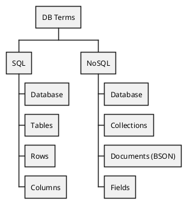

# Programação Web 1
*MongoDB* <logos-mongodb />

---

# Objetivos de aprendizagem
- Conhecer o conceito de bancos de dados NoSQL
- Iniciar a utilização do MongoDB
- Criar conta MongoDB Atlas

---

# Agenda
- SQL x NoSQL
- MongoDB
- CRUD

---
layout: section
---

# SQL x NoSQL

---

# SQL

- RDBMS (*Relational Database Management System*)
- Dados estruturados em tabelas relacionadas entre si
- Acesso e manipulação dos dados é feita utilizando SQL (*Structured Query Language*)

---

# SQL
Vantagens

- Abstração de dados independente de implementação
- Dados otimizados para armazenamento em disco
- Utilização de recursos otimizada
- Maior consistência e integridade dos dados (atomicidade, transações, durabilidade, etc)

---

# SQL
Desvantagens

- Necessidade de planejamento prévio da estrutura de dados, dificuldade em modificações
- Modelos de dados rígidos

---

# SQL
Quando usar SQL?

- Recomendado para dados com relacionamento bem definido
- Quando a integridade de dados é crítica

---

# NoSQL

- *Not only SQL*
- Desenvolvido na década de 1990, mas evidenciado em 2000 com a evolução da Computação em Nuvem, Internet, uso de dispositivos móveis e similares
- Surgiu da necessidade de bancos de dados com menores restrições e mais escaláveis

---

# NoSQL
Vantagens

- Alta escalabilidade eliminando pontos de falha únicos
- Modelos de dados flexíveis
- Criação e mudança podem ser feitas “on the fly”
- Alta performance devido à simplicidade da implementação comparada a RDBMS

---

# NoSQL
Desvantagens

- Menor disponibilidade de funcionalidades relacionadas à confiabilidade dos dados

---

# NoSQL
Quando usar NoSQL?

- Conjuntos de dados mais flexíveis que não se enquadram ou não necessitam de relacionamentos
- Dados não estruturados
- Acesso rápido a grandes volumes de dados

---
layout: two-cols-header
---

# Exemplos

:: left ::

**SQL**
- Oracle <logos-oracle />
- PostgreSQL <logos-postgresql />
- MySQL <logos-mysql />
- SQLite <logos-sqlite />

:: right ::

**NoSQL**
- Redis <logos-redis />
- Fauna <logos-fauna />
- CouchDB <logos-couchdb />
- Cassandra <logos-cassandra />
- Elasticsearch <logos-elasticsearch />
- MongoDB <logos-mongodb />

---
layout: section
---

# MongoDB

---
layout: quote
---

> "MongoDB is an open source, nonrelational database management system (DBMS) that uses flexible documents instead of tables and rows to process and store various forms of data."

Fonte: [MongoDB](https://www.mongodb.com/pt-br/what-is-mongodb)

---

# Características

- Unidade básica de dado consiste em documentos ou coleções de documentos
- Formatação básica em **JSON**
- Flexibilidade total na criação/consulta dos registros
- Confiável
- Altamente escalável

> "A JSON object is an unordered set of name/value pairs..."
Fonte: [JSON.org](https://www.json.org/json-en.html)

---

# Base de documentos

- Um registro é chamado de **documento**
- Os documentos são estruturados em pares campo/valor, similar a JSON

```json {*}{class: '!children:text-lg'}
{
    "name" : "sue",
    "age" : 26,
    "status" : "A",
    "groups" : ["news", "sports"]
}
```

---

# Por que utilizar documentos?

- Correspondem aos dados nativos utilizados nas linguagens, facilmente processáveis
- Polimorfismo de dados é facilitado
- Reduzem a necessidade de joins de alto custo computacional

---

# Estrutura de documentos

- Os nomes de campos são `strings`
- Os valores podem assumir diversos tipos, inclusive outros documentos e `arrays` de documentos
- Tipos BSON (*Binary Encoded JSON*)

```js {*}{class: '!children:text-lg'}
var mydoc = {
    _id: ObjectId("37238237"),
    name: {first: "Allan", last: "Turing"},
    birth: new Date('Jun 23, 1912'),
    death: new Date('Jun 07, 1954'),
    contribs: ["Turing Mchine", "Turing test", "Turingery"],
    views: NumberLong(1250000)
}
```

---

# Estrutura de documentos

```json {*}{class: '!children:text-lg'}
{
	"type": "icecream",
	"name": "Vanilla Cone",
	"image":
		{
			"url": "img/01.png",
			"width": 200,
			"height": 200
		},
	"thumbnail":
		{
			"url": "images/thumbnails/01.png",
			"width": 32,
			"height": 32
		}
}
```

---

# BSON Types

Formato Binário de Serialização

[Referência BSON](https://www.mongodb.com/docs/manual/reference/bson-types/)

---

# ObjectId

- MongoDB requer que cada documento de uma coleção possua um campo `_id` único que funciona como chave primária
- Se omitido, é gerado automaticamente
- `_id` é um nome de campo reservado, não pode ser atribuído a nenhum outro campo

```js {2}{class: '!children:text-lg'}
var mydoc = {
    _id: ObjectId("37238237"),
    name: {first: "Allan", last: "Turing"},
    birth: new Date('Jun 23, 1912'),
    death: new Date('Jun 07, 1954'),
    contribs: ["Turing Mchine", "Turing test", "Turingery"],
    views: NumberLong(1250000)
}
```

---

# Coleções

- Um conjunto de documentos é chamado de **coleção** (*collection*)
- *Collections* são equivalentes a tabelas em RDBMS

---

# Resumo



---
layout: section
---

# CRUD

---

# CRUD

- **Create**
- **Read**
- **Update**
- **Delete**

---

# Create
`insertOne()`

```js {*}{class: '!children:text-2lg'}
db.student.insertOne(
    {
        Name: "Akshay", 
        Marks: 500
    })
```

---

# Create
`insertMany()`

```js {*}{class: '!children:text-2lg'}
db.student.insertMany(
    [
        {name:"Ajay", age:20},
        {name:"Bina", age:24},
        {name:"Ram", age:23}
    ])
```

---

# Read
`find()`

```js {*}{class: '!children:text-2lg'}
db.users.find(
    {age: {$gt: 18}},
    {name: 1, address: 1}
).limit(5)
```

---

# Read
Exemplos

```js {*}{class: '!children:text-2lg'}
db.inventory.find({})
db.inventory.find({ status: "D" })
db.inventory.find({ $or: [ { status: "A" }, { qty: { $lt: 30 } } ] })
```

Equivalente SQL:

```sql {*}{class: '!children:text-2lg'}
SELECT * FROM inventory
SELECT * FROM inventory WHERE status = "D"
SELECT * FROM inventory WHERE status = "A" OR qty < 30
```

---

# Update

```js {*}{class: '!children:text-2lg'}
db.collection.updateOne(<filter>, <update>, <options>)
db.collection.updateMany(<filter>, <update>, <options>)
db.collection.replaceOne(<filter>, <update>, <options>)
```

---

# Delete

```js {*}{class: '!children:text-2lg'}
db.collection.deleteMany()
db.collection.deleteOne()
```

---
layout: fact
---

# Perguntas

---
layout: fact
---

# Exercícios

---

# 1
Seguir o tutorial: [MongoDB Getting Started](https://www.mongodb.com/docs/v7.0/tutorial/getting-started/)

---

# 2
Criar conta MongoDB Atlas usando o email institucional através do link abaixo. 
<br><br><br>
[Create Your Account](https://account.mongodb.com/account/register)
<br><br><br>
> "MongoDB Atlas is a multi-cloud database service..."

[MongoDB Atlas Docs](https://www.mongodb.com/docs/atlas/)

---

# 3
Configurar sua conta no MongoDB Atlas.

1. Criar conta (já feito no exercício anterior)
2. Implantar cluster gratuito
3. Configurar IP para acesso
4. Configurar senha de acesso
5. Identificar sua *connection string*

Links úteis:
- [Deploy cluster](https://www.mongodb.com/docs/atlas/tutorial/deploy-free-tier-cluster/)
- [Add IP](https://www.mongodb.com/docs/atlas/security/add-ip-address-to-list/)

---

# 4
Despois de criada a conta, execute os passos a seguir.

1. Criar bases de dados de amostra
    - Clusters -> ... -> Load Sample Dataset
2. Criar um novo banco de dados (`sample_data`) no seu *cluster* recém-criado e uma nova collection (`countries`)
    - \+ Create Database
3. Adicionar documentos na *collection* conforme o arquivo `countries.json`

---

# 5

1. Criar banco de dados `db`
2. Adicionar coleção `restaurants`
3. Importar `restaurants.json` (Ver Google Classroom da Aula 9)
4. Após importar `restaurants.json`, resolver os exercícios: [MongoDB Exercises](https://www.w3resource.com/mongodb-exercises/)

---

# Referências

- [Insert Documents](https://www.mongodb.com/docs/manual/tutorial/insert-documents/)
- [Query Documents](https://www.mongodb.com/docs/manual/tutorial/query-documents/)
- [Update Documents](https://www.mongodb.com/docs/manual/tutorial/update-documents/)
- [Remove Documents](https://www.mongodb.com/docs/manual/tutorial/remove-documents/)

---

# Referências Adicionais

- [IBM MongoDB](https://www.ibm.com/cloud/learn/mongodb)
- [MongoDB Básico](https://www.mongodb.com/pt-br/what-is-mongodb)
- [BSON](https://www.mongodb.com/basics/bson)
- [JSON.org](https://www.json.org/json-en.html)

---
layout: end
---

# Prof. José Roberto Bezerra
jbroberto@ifce.edu.br
<br><br>
<PoweredBySlidev />